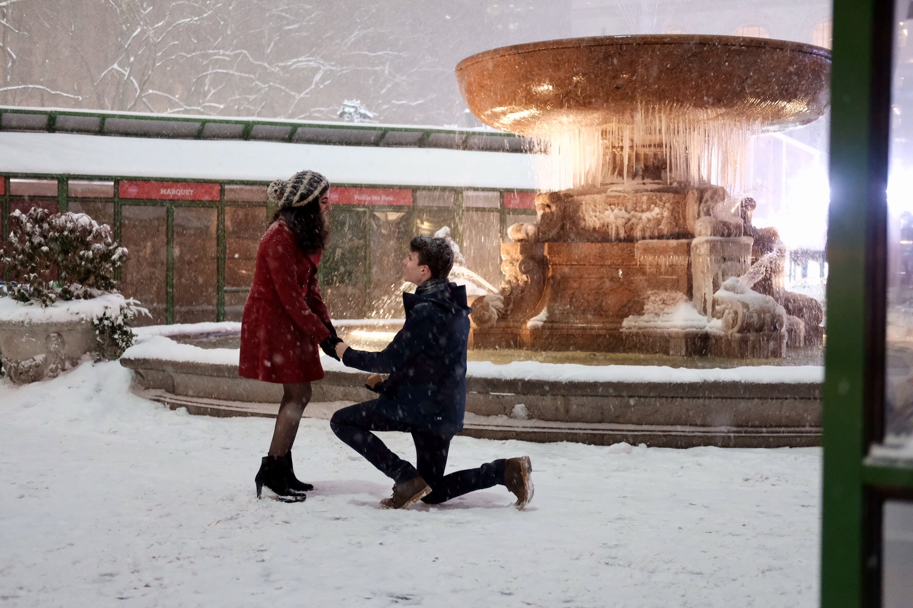

Personal life events aren't exactly this blog's purpose, but this one seems a bit too important to pass up: I got engaged yesterday! If you live in NYC or the general northeast, you'll know yesterday was *quite literally* the only day it's really snowed so far this winter. Five years ago we had our first date at Bryant Park, and although the fountain was frozen and there weren't many people around, I knew I wanted to go back for the proposal. Without getting too mushy about it, I'm a happy guy ☺️

Here's a snapshot of the moment!

<figure>
  
  <figcaption id="no-italic">😭</figcaption>
</figure>

I have to extend a *big* thanks to my good friend 👏 [Jhishan](https://twitter.com/jhishan) 👏 for the photography – the photos came out great!

---

Follow [Jhishan](https://twitter.com/jhishan) for some great photography, or follow [me](https://twitter.com/dataframing) for 'meh' tweets about data! 🐙
