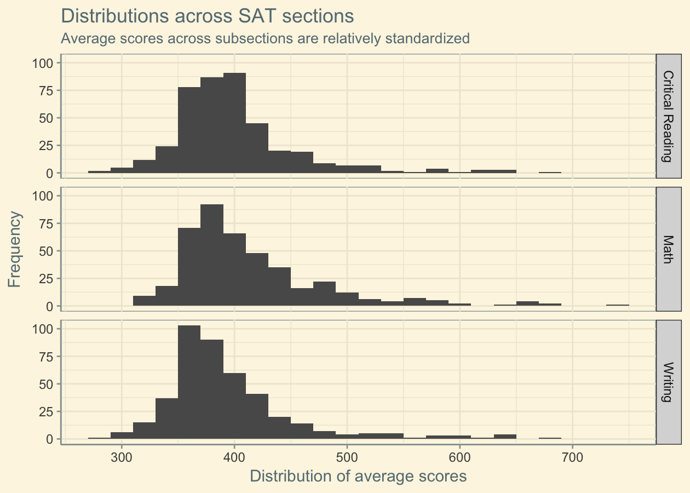
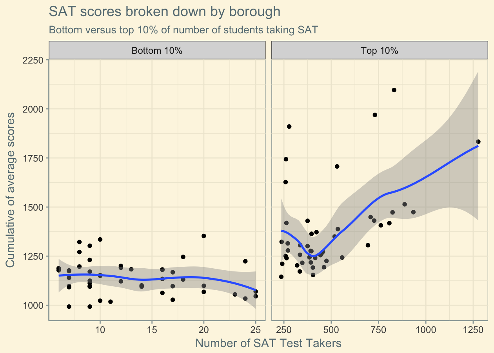
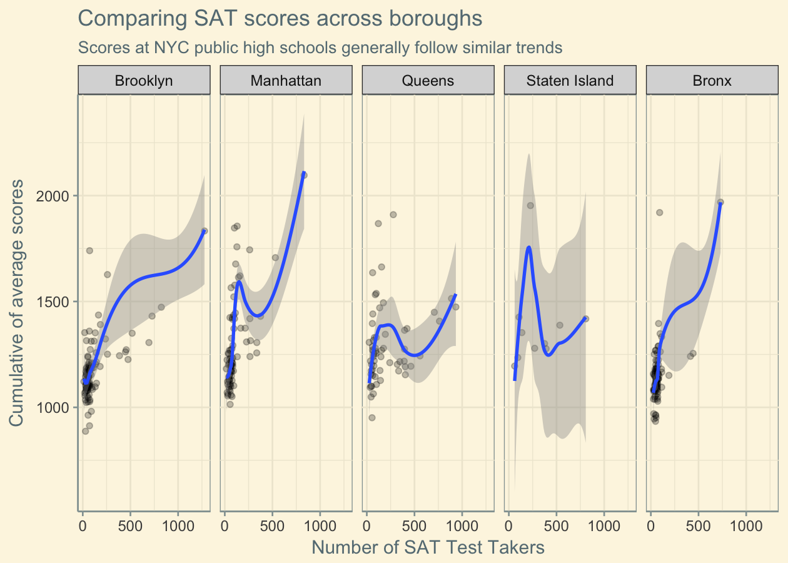

A persistent topic when discussing general education is college preparedness (and beyond, but let's leave that for another time 😊) -- how well do our high schools prepare their seniors for the SAT -- the effective gatekeeper to higher education? We can use SAT scores as a first-pass understanding of how well high schools in the city are, well, doing their job!

Let's take a look at how SAT scores vary around the city, understand what's going on, and draw some pretty graphs along the way.

# Getting the data

All of the data I'll be sourcing comes from NYC's very own open data initiative, [NYC OpenData](https://data.cityofnewyork.us/)! I've been meaning to ramp up on the difficulty/interactivity of these blog posts, and I figure the topic of NYC education has been near and dear to my heart for long enough while also proving accessible for data analysis.

> Last fall (Fall 2015) I also interned with the data and analytics team over at Success Academy Charter Schools. I got to see how they were using data science and machine learning to improve student performance and personalize learning. Really cool stuff!

``` r
library(knitr)
library(tidyverse)
library(reshape2)
library(ggthemes)

knitr::opts_chunk$set(
  cache = TRUE,
  warning = FALSE,
  message = FALSE,
  dpi = 180,
  comment = "#>",
  collapse = TRUE
)

options(width=80)
```

# Exploratory Analysis

[This dataset](https://data.cityofnewyork.us/Education/SAT-Results/f9bf-2cp4) contains the average score, broken down by SAT section, of high school seniors across different NYC public high schools in 2012. Each record represents a high school, with each having a field for identification, name, number of students who took the SAT, along with averaged scores for each section on the exam.

```r
# School-wise breakdown of test takers, average scores, etc.
scores <- read_csv("./data/SAT_Results.csv", col_types = "ccnnnn")
```

By the power of the tidyverse, we can easily do some work to make the dataset slightly more pleasant and opt to do so.

```r
# Tidying column and school names
names(scores) <- names(scores) %>%
  make.names %>%
  tolower

scores <- scores %>%
  mutate(school.name = stringr::str_to_title(school.name))
```

Let's start off with a high-level understanding of the data -- or, as Roger Peng puts it, ["check the packaging"](https://bookdown.org/rdpeng/exdata/exploratory-data-analysis-checklist.html#check-the-packaging).

``` r
# Subsetting and summarizing columns of interest.
scores %>%
  select(num.of.sat.test.takers:sat.writing.avg..score) %>%
  rename(n.test.takers = num.of.sat.test.takers,
         reading.avg = sat.critical.reading.avg..score,
         math.avg = sat.math.avg..score,
         writing.avg = sat.writing.avg..score) %>%
  summary %>%
  kable
```

|  Statistic   | n.test.takers |  reading.avg   |    math.avg    | writing.avg  |
|:------------:|:-------------:|:--------------:|:--------------:|:------------:|
| Minimum      | 6.0           | 279.0          | 312.0          |  286         |
| 1st Quartile | 41.0          | 368.0          | 371.0          | 360          |
| Median       | 62.0          | 391.0          | 395.0          | 381          |
| Mean         | 110.3         | 400.9          | 413.4          | 394          |
| 3rd Quartile | 95.0          | 416.0          | 437.0          | 411          |
| Maximum      | 1277.0        | 679.0          | 735.0          | 682          |
| NA's         | 57            | 57             | 57             | 57           |

High-level summary statistics don't reveal anything particularly interesting about the results across the board: there's no skew between medians and modes, and despite *wide* distances between minimum and maximum scores the distributions don't seem all that odd. The 57 NA records represent 57 public high schools where 5 or fewer seniors took the SAT, and thus their scores are not reported for privacy and identification purposes.

It's worrisome that **12% (57/478) of public high schools in the city are unable to prepare and send a meagre 5 students to take the SAT**. I'm not sure how this figure compares to other school systems both nationwide and in other urban areas, but it would be worth evaluating how NYC measures up and whether it's a NYC Department of Education problem, a metropolitan education issue, or a general US education deficiency.

Looking at score distributions, there isn't much variation in distribution, either (unimodal around the high 300s, long right tails):

``` r
scores.melted <- scores %>%
  select(sat.critical.reading.avg..score:sat.writing.avg..score) %>%
  melt

section_labels <- c("sat.critical.reading.avg..score" = "Critical Reading",
                    "sat.math.avg..score" = "Math",
                    "sat.writing.avg..score" = "Writing")

# Draw!
ggplot(scores.melted, aes(value)) +
  geom_histogram(binwidth = 20) +
  facet_grid(variable ~ ., scales = "fixed",
             labeller = as_labeller(section_labels)) +
  labs(y = "Frequency",
       x = "Distribution of average scores") +
  theme_solarized() +
  ggtitle("Distributions across SAT sections",
          subtitle = "Average scores across subsections are relatively standardized")
```



We can also take a look at schools who had the least and most students take the SAT -- is there a strong correlation between number of test takers and cumulative outcome?

``` r
# Obtain top and bottom 10% of number of SAT takers.
top <- scores %>%
  arrange(desc(num.of.sat.test.takers)) %>%
  head(n = 0.10 * nrow(scores)) %>%
  transmute(school.name = school.name,
            num.of.sat.test.takers = num.of.sat.test.takers,
            cumulative = rowSums(.[4:6]),
            top = 1)

bottom <- scores %>%
  arrange(num.of.sat.test.takers) %>%
  head(n = 0.10 * nrow(scores)) %>%
  transmute(school.name = school.name,
            num.of.sat.test.takers = num.of.sat.test.takers,
            cumulative = rowSums(.[4:6]),
            top = 0)

# Store our translation labels for nicer facet grid labels.
top_labels <- c("1" = "Top 10%", "0" = "Bottom 10%")

# Join and melt our two dataframes.
all.melted <- rbind(top, bottom) %>%
  melt(id=c("school.name", "num.of.sat.test.takers", "top")) %>%
  arrange(desc(num.of.sat.test.takers)) %>%
  mutate(top = as.factor(top))

# Draw!
ggplot(data = all.melted,
       aes(x=num.of.sat.test.takers, y=value)) +
  geom_point() +
  stat_smooth() +
  facet_grid(. ~ top, scales = "free_x",
             labeller = as_labeller(top_labels)) +
  theme_solarized() +
  labs(x = "Number of SAT Test Takers",
       y = "Cumulative of average scores") +
  ggtitle(label = "SAT scores broken down by borough",
          subtitle = "Bottom versus top 10% of number of students taking SAT")
```



There might just be something here! It's worth noting that this isn't apples-to-apples for a number of reasons:

-   the schools that sent the fewest students don't report SAT scores

-   we also expect that having a greater number of students taking the exam will anchor the scores at a certain range: with a smaller sample size we would expect more variance

-   we don't have an understanding of what proportion of students per school take the SAT -- only a raw value -- and so there's no consideration of school population

That said, it's interesting to see the significant difference between the top and bottom 10% of schools. If we could account for the above points (by sourcing an outside dataset or aggregating over more time, perhaps) it would be interesting to see whether we could support the hypothesis that *high schools where a greater number of students take the SAT are more academically rigorous or better-equipped*. This is not to bash low-performing high schools, rather, we can imagine a reallocation of resources (academic, financial, etc) that can improve schools in the bottom percentiles.

# Spatial Analysis

The above analysis leaves a lot to be seen: what about location? It's no secret that schools in better neighborhoods are more likely to have better resources for students, but can we quantitatively see that? Sourcing another dataset by NYC OpenData, a [directory of 2014 - 2015 NYC public high schools](https://data.cityofnewyork.us/Education/DOE-High-School-Directory-2014-2015/n3p6-zve2), we get more per-school location information, including borough, zip code, and latitude + longitude.

``` r
# School-wise breakdown on NYC schools, including location!
directory <- read_csv("./data/DOE-High-School-Directory-2013-2014.csv")

# Tidying column and school names
names(directory) <- names(directory) %>%
  make.names %>%
  tolower
```

The data itself is already pretty tidy, which is a nice surprise! Using the provided data, however, we note that we lose ~100 records post-join:

``` r
joined <- inner_join(scores, directory, by = "dbn")
not_joined <- anti_join(scores, directory, by = "dbn")

c(nrow(joined), nrow(not_joined))
#> [1] 368 110
```

My suspicion is that I'm crossing dates -- the SAT score data is from 2012-2013 but the directory for high schools is from 2013-2014. That said, I also previously attempted this join with directory data from 2014-2015 and had the same number of records dropped -- it's likely a deeper issue (some schools that reported scores not in directory for whatever reason). Given that we're not in the sample size business (this time, at least) we can keep the analysis going.

``` r
# Isolate columns of interest
schools <- joined %>%
  select(dbn:sat.writing.avg..score, boro,
         zip, total.student.10.26, program.highlights,
         latitude, longitude, grade.span.2014.2015.max,
         grade.span.2014.2015.min) %>%
  mutate(boro = as.factor(boro), zip = as.factor(zip))

schools$boro <- schools$boro %>%
  recode(M = "Manhattan", X = "Bronx", K = "Brooklyn",
         Q = "Queens", R = "Staten Island")

schools <- schools %>%
  mutate(cumulative = rowSums(.[4:6]))
```

We can take a quick look at descriptive statistics now that we have a few more dimensions. Is there any noticeable difference between cumulative SAT scores across boroughs?

``` r
borough <- schools %>%
  select(school.name, boro, cumulative,
         num.of.sat.test.takers:sat.writing.avg..score)

ggplot(borough, aes(x = num.of.sat.test.takers, y = cumulative)) +
  facet_grid(. ~ boro) +
  geom_point(alpha = 1/4) +
  stat_smooth() +
  theme_solarized() +
  labs(x = "Number of SAT Test Takers",
       y = "Cumulative of average scores") +
  ggtitle(label = "Comparing SAT scores across boroughs",
          subtitle = "Scores at NYC public high schools generally follow similar trends")
```



There doesn't seem to be a consistent difference between boroughs -- generally, number of SAT test takers is an "okay" proxy for how well a school does. Most boroughs have public high-performers (Manhattan's is Stuyvesant, Bronx has Bronx Science, etc.), but otherwise there seems to be a tendency for scores to settle at around 1250, which is what we'd expect given the score distribution above.

# The end

It's no secret that the public school system in NYC is flirting with misery. There's an ongoing segregation -- both racial and financial -- in the schools that ties into a lot more than this post can really cover. It's a bit disappointing to see just how *few* high school seniors take the SAT -- not even considering performance -- and how it relates to the school's academic performance culture.

> Feel free to check out any code, data, and notebooks for this analysis on the [Exploratorium](https://github.com/dataframing/exploratorium) repository! Everything's open, but get in touch if you have any questions!

---

This is the first of a series of analyses! Follow me on [Twitter](https://twitter.com/dataframing) for more soon! 🐙
