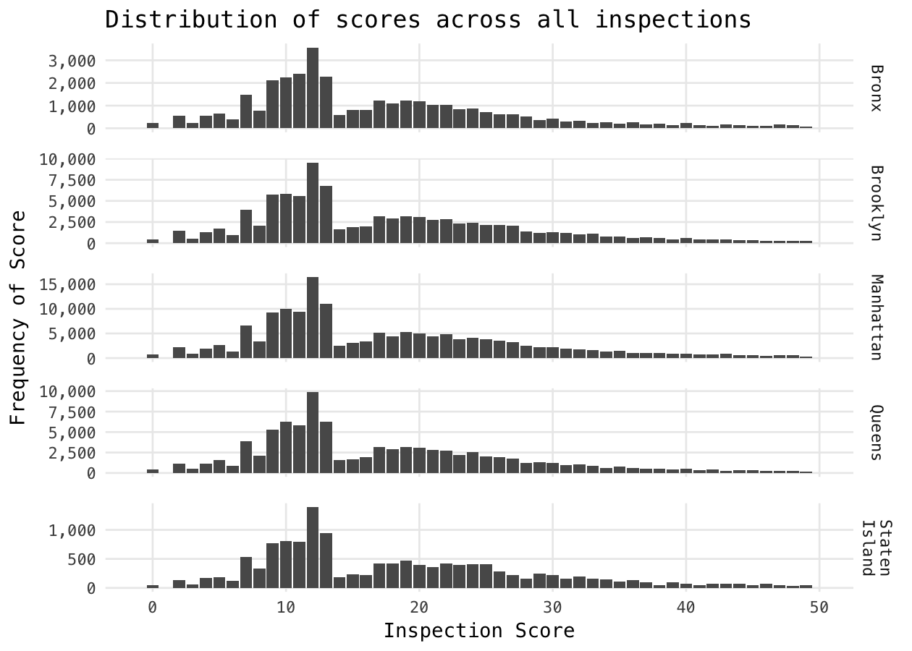
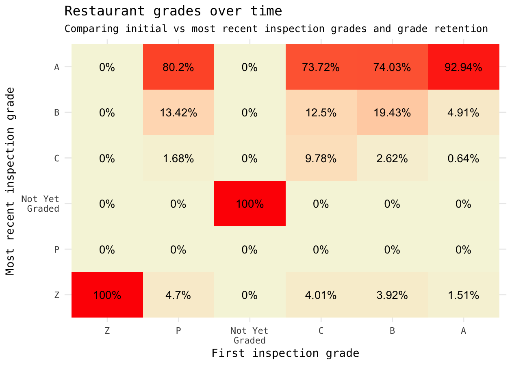
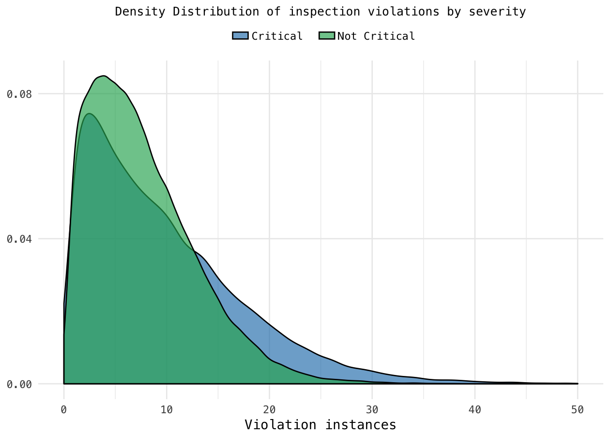

As a New York native, there's something about the food here that's just *different*. You don't realize it until you're away for long enough, but the mix between convenience, (if desired) frugality, and variety has trumped any other city I've ever visited. A cornerstone of NYC restaurants are the [sanitary inspection grades](http://brooklynink.wpengine.netdna-cdn.com/wp-content/uploads/2011/10/restaurant-ratings-abc-1031.jpg) -- generally, the higher the better (although some friends swear by tiny restaurants with C ratings as their favorites).

As a consumer of such restaurants (sometimes including C-rated places) I'd be curious to know what exactly differs between A-rated restaurants and C-rated restaurants with respect to hygiene, violations, and more. Part of me actually doesn't want to find out about the conditions of the food I eat -- sometimes ignorance *is* bliss -- but much like Pandora's box, finding this dataset can't be reversed --- so let's dive in.

# Sourcing our data

All of the data I’ll be sourcing comes from NYC’s very own open data initiative, [NYC OpenData](https://nycopendata.socrata.com/). This'll be my second analysis using NYC's Open Data portal, and you can really appreciate major cities like New York City, San Francisco, Seattle, and more providing such a rich dataset to the public.

# Exploratory data analysis

[This dataset](https://data.cityofnewyork.us/Health/DOHMH-New-York-City-Restaurant-Inspection-Results/43nn-pn8j) by the NYC Department of Health and Mental Hygiene (DOHMH) holds data on NYC restaurant inspection results for inspections dating all the way back to 2013 (there are a few records with a date of January 1, 1900, but we'll get to those). As a city-slicker and restaurant-frequenter, I have a plethora of questions I'd *like* to know more about.

Let's explore this data set and see what kind of things we can learn about New York City restaurants.

``` r
# Some behind-the-curtains setup
library(knitr)
library(tidyverse)
library(broom)
library(stringr)
library(scales)
library(ggthemes)
library(tidyr)

knitr::opts_chunk$set(
  cache = TRUE,
  warning = FALSE,
  message = FALSE,
  dpi = 180,
  comment = "#>",
  collapse = TRUE
)
options(width=80)

theme_set(theme_minimal(base_family="Menlo") +
            theme(plot.title=element_text(family="Menlo")))
```

# Data wrangling / cleaning

There's no free lunch -- even when it comes to free data -- and this dataset needs a bit of grooming before we can perform any interesting analysis.

``` r
# Read in that data.
data <- read_csv("../data/DOHMH_New_York_City_Restaurant_Inspection_Results.csv")

# Tidying column and school names
names(data) <- names(data) %>%
  make.names %>%
  tolower
```

While reading it in, we can immediately see that there are records that confuse *readr*'s CSV parser. Luckily, those records only have to do with the phone number field (*phone*) which we're not particularly concerned with. It's also relatively apparent that the recorded inspection date field has entries that were empty and defaulted to January 1, 1900, so we'll omit those (total of 863 records).

``` r
# Define function for future mutate_at to work with mm/dd/YYYY format.
normalize.mm.dd.yyyy <- function(x) {
  transformed <- as.Date(x, format = "%m/%d/%Y")
  return(transformed)
}

# Mutate violations data into proper column-by-column format.
violations <- data %>%
  select(camis, dba, boro, zipcode, cuisine.description, inspection.date,
         action, violation.code, violation.description, critical.flag,
         score, grade, grade.date) %>%
  mutate_at(.cols = vars(dba, boro),
            .funs = str_to_title) %>%
  mutate_at(.cols = vars(inspection.date, grade.date),
            .funs = normalize.mm.dd.yyyy) %>%
  mutate_at(.cols = vars(boro, cuisine.description, critical.flag, grade),
            .funs = as.factor) %>%
  filter(inspection.date != "1990-01-01")
```

It's important to note that the `camis` field is our primary key -- it's located on each restaurant's Food Service Establishment permit and a uniquely-identifiable value. From a data point of view, we should verify the integrity of the `grade` field -- after all, it'll likely be at the heart of many questions we'd like to ask of our data.

``` r
# Summarize inspection grades
summary.violations <- violations %>%
  select(grade) %>%
  summary %>%
  str_split(pattern = ":", simplify = T) %>%
  data.frame

# Present inspection summary
summary.violations %>%
  rename(Grade = X1, Frequency = X2) %>%
  mutate_all(.funs = str_trim) %>%
  mutate(Frequency = as.numeric(Frequency)) %>%
  kable(align = "cr")
```

|      Grade     |  Frequency|
|:--------------:|----------:|
|        A       |     161284|
|        B       |      33679|
|        C       |       8450|
| Not Yet Graded |       1907|
|        P       |       1450|
|        Z       |       2053|
|      NA's      |     226016|

Woah! It seems like we've jumped the gun: there are P and Z grades and...a whole lot of NA's. It turns out that we're looking at the data incorrectly: this dataset is [longitudinal (or, "panel") data](https://en.wikipedia.org/wiki/Panel_data), which means that we may be looking at one or more restaurants over one or more time periods. If we look at my current NYU zip code (10003) and choose a random restaurant, multiple rows will be returned:

``` r
# Some pre-processing to make our chain easier.
restaurants.at.10003 <- violations %>%
  filter(zipcode == 10003)

# Function to get a random camis ID.
get.random.camis <- . %>%
  select(camis) %>%
  group_by(camis) %>%
  summarize(count = n()) %>%
  filter(count < 6) %>%
  select(camis) %>%
  sample_n(1) %>%
  as.numeric

# Sample one restaurant in 10003.
random.id <- restaurants.at.10003 %>%
  get.random.camis

# Get all records for that restaurant.
entire.tb <- restaurants.at.10003 %>%
  filter(camis == random.id) %>%
  select(dba, boro, inspection.date, violation.description,
         critical.flag, score, grade) %>%
  arrange(desc(inspection.date))

# Tabulate!
entire.tb %>%
  select(-dba, -boro) %>%
  kable(align = "clccc")
```

| inspection.date | violation.description                                                                                                                                                                                                                                                           | critical.flag | score | grade |
|:---------------:|:--------------------------------------------------------------------------------------------------------------------------------------------------------------------------------------------------------------------------------------------------------------------------------|:-------------:|:-----:|:-----:|
|    2016-12-02   | Food contact surface not properly washed, rinsed and sanitized after each use and following any activity when contamination may have occurred.                                                                                                                                  |    Critical   |   5   |   A   |
|    2015-08-12   | Non-food contact surface improperly constructed. Unacceptable material used. Non-food contact surface or equipment improperly maintained and/or not properly sealed, raised, spaced or movable to allow accessibility for cleaning on all sides, above and underneath the unit. |  Not Critical |   3   |   A   |

(All above records belong to Manhattan restaurant *Fuku*)

Were we a bit wiser, we would have looked at NYC DOHMH's handy-dandy ["How We Score And Grade"](http://www1.nyc.gov/assets/doh/downloads/pdf/rii/how-we-score-grade.pdf), or a great secondary source: the [FAQ on BulletProof! Food Safety's blog](http://www.bulletprooffoodnyc.com/faqs-inspections-hearings/). In short, we learn:

- Scores are a measure of violations, so a lower score is better. Broken down:

  - A: 0 - 13 points
  - B: 14 - 27 points
  - C: &gt; 28 points

- There are different penalties (scores) for different violations, with some more severe than others.
- Only two inspections can lead to a letter grade:

  - If a restaurant gets an A on their initial inspection, they score and are graded an A.
  - If a restaurant does **not** get an A on their initial inspection, they score a B or C but are not graded until a re-inspection.

- Some inspections are *scored*, but not graded (aha!):

  - Initial inspections that result in a score of 14 points or higher (as we'd expect).
  - Monitoring inspections, or inspections performed after a restaurant hasn't done well during a re-inspection.
  - Inspections at restaurants that aren't open to the public yet.
  - Inspections at restaurants seeking to reopen after being closed by the DOH.

So, great! That clears up why not all of our records have grades: not only can we have multiple inspections *per restaurant*, but not every inspection results in a grade! I feel pretty good about diving into the dataset, so let's take a look!

# Score and grade distributions

Given that each visit will result in a score and not necessarily a grade, a first-pass understanding of how restaurants in the NYC area perform is a look into their raw scores. Note: we have yet to aggregate by restaurant, so this is not the same as asking "How does each restaurant do?"

``` r
# Inspection scores across all recorded inspections.
violations %>%
  select(score, boro) %>%
  filter(boro != "Missing" & score >= 0) %>%
  na.omit() %>%
  ggplot(mapping = aes(x = score)) +
    geom_bar() +
    facet_grid(boro ~ ., scales = "free_y",
               labeller = labeller(boro = label_wrap_gen(10))) +
    lims(x = c(-1, 50)) +
    scale_y_continuous(labels = comma) +
    theme(panel.spacing.y = unit(1, "lines"),
          panel.grid.minor = element_blank()) +
    labs(x = "Inspection Score", y = "Frequency of Score",
         title = "Distribution of scores across all inspections")
```



As it turns out, there's a significant cliff on scores from 13 to 14 points -- the exact cutoff between an "A" and "B" rating. While I would *hope* this is attributable to a higher proportion of "A" rated initial inspections, we can also take a look at aggregate information on grade retention -- how often do restaurants initially graded "B" rise to "A", and vice versa?

``` r
# For each restaurant, aggregate all records with a grade and date
# and isolate the earliest -- this is the restaurant's first-ever grade.
first.grading <- violations %>%
  filter(!is.na(grade) & !is.na(grade.date)) %>%
  group_by(camis) %>%
  arrange(grade.date) %>%
  filter(row_number() == 1)

# Just like :first.grading, except get the most-recent grade.
last.grading <- violations %>%
  filter(!is.na(grade) & !is.na(grade.date)) %>%
  group_by(camis) %>%
  arrange(grade.date) %>%
  filter(row_number() == n())

# Get the number of restaurants that initially earned an "A", "B", etc.
grade.counts <- first.grading %>%
  group_by(grade) %>%
  summarize(count = n())

# Join the first and last grades for each restaurant -- will use this later :)
first.last.grading <-
  inner_join(first.grading, last.grading,
             by = "camis", suffix = c(".first", ".last")) %>%
  select(camis, dba.first, boro.first, zipcode.first,
         cuisine.description.first, inspection.date.first,
         grade.first, grade.date.first, inspection.date.last,
         grade.last, grade.date.last)

# Group by the first and last grades to determine
# how many went from "A" => "A", "B" => "A", etc.
first.last.percentages <- first.last.grading %>%
  group_by(grade.first, grade.last) %>%
  summarize(n.restaurants = n()) %>%
  mutate(total.at.start = as.numeric(grade.counts[grade.counts$grade == grade.first, "count"]),
         percent.of.start = round((n.restaurants / total.at.start) * 100, 2))

# Plot heatmap of first and last grades -- we fill in for missing
# combinations (e.g. "Z" => "A") with tidyr::complete().
first.last.percentages %>%
  complete(nesting(grade.first), grade.last,
           fill = list(percent.of.start = 0)) %>%
  ggplot(mapping = aes(x = grade.first, y = grade.last)) +
    geom_tile(aes(fill = percent.of.start)) +
    scale_fill_gradient(low = "beige", high = "red", guide = "none") +
    geom_text(aes(label = paste(percent.of.start, "%", sep = ""))) +
    scale_x_discrete(limits = c("Z", "P", "Not Yet Graded", "C", "B", "A"),
                     labels = function(x) str_wrap(x, width = 7)) +
    scale_y_discrete(limits = c("Z", "P", "Not Yet Graded", "C", "B", "A"),
                     labels = function(x) str_wrap(x, width = 7)) +
    labs(x = "First inspection grade", y = "Most recent inspection grade",
         title = "Restaurant grades over time",
         subtitle = "Comparing initial vs most recent inspection grades and grade retention")
```



The above chart is read like so: of all restaurants who were initially graded at an "A", 92.94% retained that "A" during their most recent graded inspection. From the above chart, we can conclude that **a majority of restaurants that graded below an A on their initial inspection have since improved** and **restaurants that initially graded an A mostly retain that grade.**

A 100% grade retention over time seemed suspicious at first, but after checking the data it seems as though these are 80 "Z" and "Not Yet Graded" grade restaurants whose first inspection *is* their most recent inspection.

# Worst offenders

This blog/series isn't meant to be an exposé or tell-all about restaurants, but it's on everyone's mind: where should you definitely *not* go? Of restaurants that are currently open, who are the worst offenders?

``` r
# These restaurants are for those with iron stomachs.
# We filter to remove invalid inspection dates and inspections
# where the restaurant was closed down. Then, get the most recent
# inspection and that date's (highest) score. The rest is sugar.
violations %>%
  filter(!is.na(inspection.date) &
           !grepl("Establishment Closed by DOHMH.", x = action)) %>%
  group_by(camis) %>%
    arrange(inspection.date, score) %>%
    filter(row_number() == n()) %>%
    ungroup(camis) %>%
  mutate(restaurant.name = stringr::str_to_title(dba)) %>%
  select(restaurant.name, score, cuisine.description,
         boro, inspection.date) %>%
  arrange(desc(score)) %>%
  head %>%
  kable(align = "lrllc")
```

| restaurant.name           |  score| cuisine.description                                              | boro      | inspection.date |
|:--------------------------|------:|:-----------------------------------------------------------------|:----------|:---------------:|
| New York Sushi            |    114| Japanese                                                         | Queens    |    2016-06-14   |
| The Standard East Village |     86| American                                                         | Manhattan |    2016-12-19   |
| Bamboo Garden Restaurant  |     73| Chinese                                                          | Brooklyn  |    2016-12-21   |
| White Maize               |     72| Latin (Cuban, Dominican, Puerto Rican, South & Central American) | Brooklyn  |    2016-10-12   |
| A+ Roof Bar               |     71| Other                                                            | Queens    |    2016-05-21   |
| Masala Club               |     70| Indian                                                           | Manhattan |    2016-12-13   |

I can't tell you what to do, but I wouldn't suggest going to those restaurants.

# Violation severity

Not all violations are made equal -- you're likely much more averse to eating somewhere with 5 or more critical violations (🍔🐀💩) as opposed to a restaurant with 5 - 10 non-critical violations. Can we learn anything from the occurrence of critical vs non-critical violations?

Let’s overlay the two violation severity distributions after normalizing and smoothing with a [2D kernel density estimator](https://en.wikipedia.org/wiki/Kernel_density_estimation).

``` r
# Define some of the boilerplate logic for
# our future pipe chains.
inner.crit.logic <- . %>%
  select(camis, dba, boro, cuisine.description) %>%
  group_by(camis) %>%
    mutate(count = n()) %>%
    filter(row_number() == 1) %>%
    ungroup(camis) %>%
  arrange(desc(count))

# Obtain, for each restaurant, the number of critical violations.
critical <- violations %>%
  filter(critical.flag == "Critical") %>%
  inner.crit.logic %>%
  mutate(critical = "Critical")

# Likewise, but for non-critical violations.
non.critical <- violations %>%
  filter(critical.flag == "Not Critical") %>%
  inner.crit.logic %>%
  mutate(critical = "Not Critical")

# Get the density distribution for our each of our violation severities.
rbind(critical, non.critical) %>%
  ggplot(mapping = aes(x = count, group = critical, fill = critical)) +
    scale_fill_manual(labels = c("Critical  ", "Not Critical"),
                      values = c("#2980b9", "#27ae60")) +
    scale_y_continuous(breaks = c(0, 0.04, 0.08)) +
    geom_density(alpha = 2/3) +
    lims(x = c(0, 50)) +
    theme(panel.grid.minor.y = element_blank(),
          axis.title.y = element_blank(),
          legend.title = element_blank(),
          legend.position = "top",
          legend.direction = "horizontal",
          legend.key.width = unit(0.5, "cm"),
          legend.key.height = unit(0.25, "cm"),
          plot.subtitle = element_text(hjust = 0.5)) +
    labs(x = "Violation instances",
         subtitle = "Density Distribution of inspection violations by severity")
```



The long right tail isn't particularly surprising, but what *is* surprising is that at larger numbers, critical violations are more probable than non-critical violations.

<!-- # Do It Yourself! -->
<!-- Here's probably the coolest part of the analysis: I've set up a Shiny webapp for some interactive exploring -- feel free to [check it out]()! I've designed it with you in mind, so feel free to enter an NYC zip code to get started. Some of the plots there aren't actually included in this post, so for the completionists out there, you'll definitely want to check it out. (This is coming soon!) -->

# The end

I've never thought I would rather *not* know the results of an analysis, but this post is giving me a run for my money. Restaurants that currently have an A grade can still have critical health and hygiene violations? Time to wrap this one up and never eat out again.

> Feel free to check out any code, data, and notebooks for this analysis on the [Exploratorium](https://github.com/dataframing/exploratorium/NYC-Restaurants) repository! Everything's open, but get in touch if you have any questions!

---

Follow me on [Twitter](https://twitter.com/dataframing) for tweets about <del>food</del> data. 🐙
