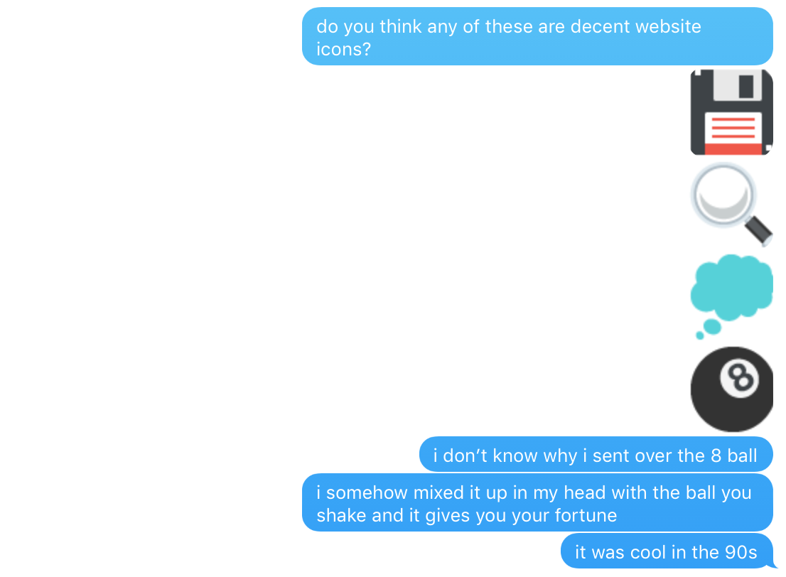
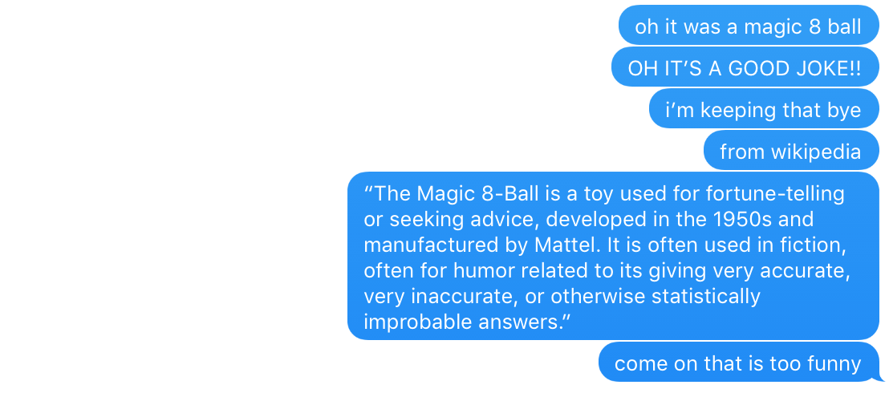
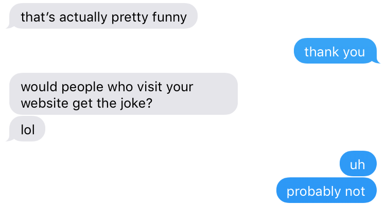

In the spirit of making a website mine, I've made quite some progress from [getmicah](https://github.com/getmicah/blog)'s original Jekyll template: I added and removed quite a bit of CSS, content (bookshelf, Exploratorium), [HighlightJS](https://highlightjs.org/), etc. As someone who is “““artistically unable""", I'm pretty proud of the strides I've made in the *general* web development space. One thing has always bothered me, though: the website icon.

In my opinion, the default icon wasn't all that bad: it was a picture of the mouse on OSX. Looks kinda like so:

<figure>
  
  <figcaption>It smells like...courage</figcaption>
</figure>

This was fine for a temporary icon \-\- I mean, it's better than *not having* an icon, so whatever.

Today, though, I was doing some work for NYU's ACM chapter (current VP woot woot!) and decided to download a bunch of high-res Emoji off of [EmojiOne](http://emojione.com/). I found the design of these Emoji much nicer than Apple's base family, and wanted to use some in our promotional material.

What's cool about EmojiOne is that they offer emoji at different resolutions: 64x64, 128x128, and 512x512. Then, it hit me: icons are also 64x64 \-\- time for a new icon (maybe)! And so I went into the great Emoji unknown.

I emerged from my hunt with four finalists. None of them all that great \-\- after all, <del>how do you beat a mouse cursor</del> what sort of icon works well for a site called *datafra.me*? Actual data, or maybe dplyr's pipe "%>%"?

I sought my fiancé's counsel:

<figure>
  
  <figcaption>"It was cool in the 90s" -- things I actually say and mean</figcaption>
</figure>

The word for this puzzling sphere was right on my tongue -- magic ball? It has a die in it, remember? Gahhh.

Well, let me tell you I was excited to remember that it was called a "Magic 8 Ball". I could have found that out by looking up "8 Ball emoji" and seeing it referenced as "Magic 8 Ball Emoji". *Well now I knew*, and boy did I want to tell others \-\- so I told my fiancé (who else would care?):

<figure>
  
  <figcaption>"It's a good joke!!" -- things I actually say and think</figcaption>
</figure>

Yes, Wikipedia's entry for "Magic 8 Ball" lists:

> ... It is often used in fiction, often for humor related to its giving very accurate, very inaccurate, or otherwise statistically improbable answers.

And boy, isn't that a perfect description for this blog. Just...perfect 😭

And, to my surprise, I received some positive feedback (so, not all negative)! And yet, right when I thought I had vanquished defeat, just one problem: will everyone get it?

<figure>
  
  <figcaption id="no-italic">😰</figcaption>
</figure>

I'm a selective pessimist, so **no, not everyone would get the reference.**

So here I am, explaining the joke. You're welcome.

---

Follow [me](https://twitter.com/dataframing) on Twitter for more of the 90s. 💯
