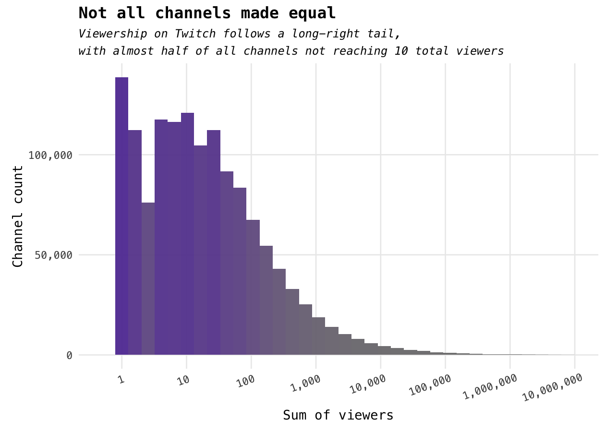
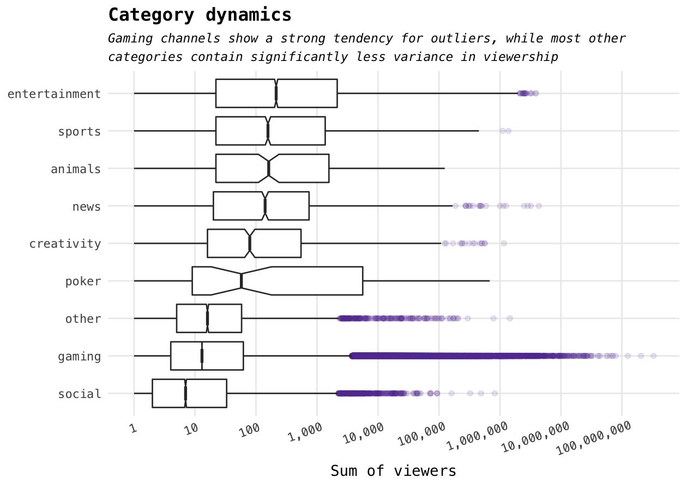
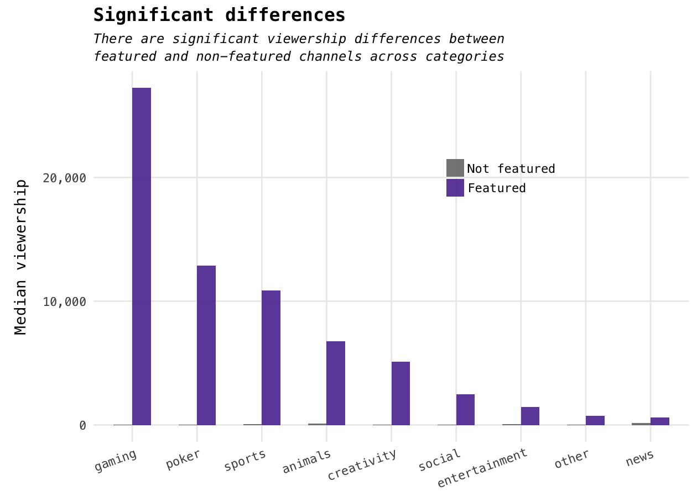
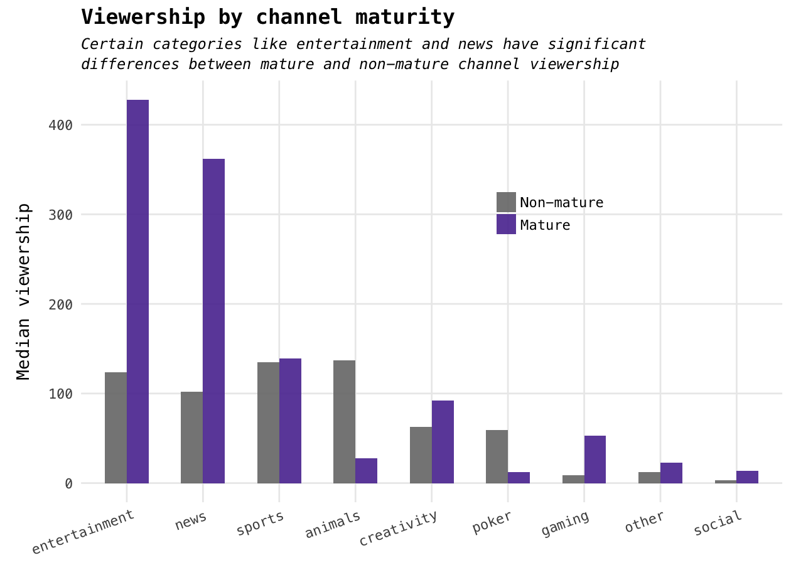

[Twitch](https://www.twitch.tv/) is a platform for anyone to host live video streams. Think of Twitch as the platform  you didn't know you wanted: you can watch hosts do their thing (gaming, news, etc.), chat with other users live, interact with the host, make donations to the channel, and much more. Well-known as a bedrock for the gaming and e-sports communities, Twitch has massively influenced the livestream market \-\- ranking [fourth in peak US Internet traffic](https://blog.twitch.tv/twitch-is-4th-in-peak-us-internet-traffic-90b1295af358#.onmeqfe4b) in 2014.

I stumbled upon a 2013 data set (I know, I know, it's a bit old \-\- but it's the principle that counts...right? Right?) of channel and session data for Twitch, and knew I wanted to take a look. Twitch has changed a *ton* since 2013, but it's still interesting to see how we can retro-actively understand broadcaster dynamic and user behavior on the early live-streaming platform \-\-\- what trends emerge, and how can we reason about platform dynamics? What can we say about site audience interests given session data?

All interesting questions! Let's find out.

Sourcing the data
=================

All of the data can be found on [Telecom Bretagne](http://dash.ipv6.enstb.fr/dataset/live-sessions/) \-\- a research center and (I *think*) college in France. From what I can tell, Telecom Bretagne curated this dataset for submission into the 2015 ACM Multi-media Systems \-\- MMSYS 2015 \-\- conference, so it seems pretty legit. Telecom Bretagne actually has both Youtube Live and Twitch data sets from 2013 and numerous data sets, to boot. The original datasets are 81 GB (Youtube Live) and 241 GB (Twitch) of streaming data, but they've done us the favor of providing aggregated data sets that are much more reasonable in size (2.4 GB).

Telecom Bretagne claims that this data was collected from Twitch's API. A minor note is that \-\- to my knowledge \-\- we can't easily verify the integrity of our data set. Ideally we would ping Twitch's API ourselves over a few weeks or months for this data, but we'll have to make-do with some older data. I trust the French, however, so I'll let it slide this time. Let's get to the cleaning!

Data cleaning / wrangling
=========================

The data set itself didn't require much cleaning at all \-\- then again, I'm sure the researchers did it for us. I'll be posting a [part 2 to this post](javascript: void(0)) (that link will be valid when it's live) where I tackle a larger, less aggregated data set \-\- there, one of the problems I faced was data volume. But with no outstanding issues in our data set, we can move on to the analysis. Here are the defaults I'm working with:

``` r
# Some behind-the-curtains setup
library(knitr)
library(scales)
library(ggthemes)
library(tidyverse)

knitr::opts_chunk$set(
  cache = TRUE,
  warning = FALSE,
  message = FALSE,
  dpi = 180,
  comment = "#>",
  collapse = TRUE
)

options(width = 75)

theme_set(theme_minimal(base_family = "Menlo") +
            theme(plot.title=element_text(family = "Menlo")))
```

Exploratory data analysis
=========================

I'll be exploring the channel data set, which should give us insight into Twitch broadcasters and audiences. Let's take a look!

``` r
# Read in our master data set.
data <- read_csv("../data/channels.csv")
```

Before any analysis, I'll take a look at the variables provided and scope out which ones I'd like to look into. As it turns out, we don't really need some of this information. Columns relating to bitrate, broadcaster, audio and video codec, etc. haven't really stood out to me and don't really offer much (in my opinion) with respect to analysis interpretability, so I'll filter those out. We can also filter out "channel\_id" \-\- kind of like a unique ID assigned to a channel for identification \-\- because we have "channel\_login" as a more descriptive unique channel identifier.

``` r
# Remove a few columns and replace <NA>'s in the mature column.
channels <- data %>%
  select(
    -starts_with("video_bitrate"),
    -ends_with("codec"),
    -one_of("broadcaster", "channel_id")
  ) %>%
  replace_na(list(mature = "False"))
```

My initial exploration question is pretty high-level: how does channel popularity manifest on Twitch? We can take a rough first-look by using the "viewers\_sum" field, which is an aggregated sum of the total number of viewers that channel has had across 3 months worth of sessions (remember: these values are aggregates \-\-\- I'll be sure to highlight where that might lead to a lack of interpretability, but it's helpful to keep in mind).

``` r
# Define our color "palette" :)
twitch.purple <- "#6441A4"

# Plot histogram of viewers_sum field.
channels %>%
  select(viewers_sum) %>%
  ggplot(mapping = aes(x = viewers_sum, fill = viewers_sum, color = viewers_sum)) +
    geom_histogram(bins = 37, mapping = aes(fill = ..count..), alpha = 97/100) +
    scale_x_log10(breaks = 10^(0:7), labels = 10^(0:7) %>% comma, limits = c(0.5, 10^7)) +
    scale_y_continuous(labels = comma) +
    scale_fill_continuous(low = "grey50", high = twitch.purple, guide = F) +
    labs(x = "Sum of viewers", y = "Channel count",
         title = "Not all channels made equal",
         subtitle = paste("Viewership on Twitch follows a long-right tail,",
                          "with almost half of all channels not reaching 10 total viewers.",
                          sep = "\n")) +
    theme(panel.grid.minor = element_blank(),
          axis.text.x = element_text(angle = 20, hjust = 0.9),
          plot.title = element_text(face = "bold"),
          plot.subtitle = element_text(face = "italic", size = 9.5,
                                       lineheight = unit(1.25, "cm")),
          axis.title.x = element_text(margin = margin(t = 5, b = 5)),
          axis.title.y = element_text(margin = margin(l = 5, r = 5)))
```



To nobody's surprise, channel view count is a long, *long* right tail with an already-tiny minority of users gaining 100 viewers over approximately three months. I expected a prominent tail, but the strong concentration at particularly low values is worth digging into. To do so, we can use a cumulative sum table to see the increasing change between groups.

``` r
# Sigh. The things we do for nicer bins.
bin.breaks <- c("0")
for (i in 0:8) {
  bin.breaks <-
    append(bin.breaks,
           paste("[",  format(10^i, scientific = F, big.mark = ","),
                 ", ", format(10^(i+1), scientific = F, big.mark = ","),
                 ")", sep = "")
           )
}

# Tabulate viewer sums based on logged binning!
channels %>%
  select(viewers_sum) %>%
  as.vector %>%
  unlist(use.names = F) %>%
  cut(breaks = c(0, 10^(0:9)), right = F) %>%
  table %>%
  data.frame %>%
  transmute(
    viewer.range = bin.breaks,
    range.size = format(.$Freq, big.mark = ","),
    cumulative.freq = percent(cumsum(.$Freq) / sum(.$Freq))
  ) %>%
  kable(align = "lrr")
```

| viewer.range                  |  range.size|  cumulative.freq|
|:------------------------------|-----------:|----------------:|
| 0                             |     164,285|            10.7%|
| \[1, 10)                      |     590,286|            49.1%|
| \[10, 100)                    |     508,877|            82.2%|
| \[100, 1,000)                 |     204,167|            95.5%|
| \[1,000, 10,000)              |      52,367|            98.9%|
| \[10,000, 100,000)            |      12,618|            99.8%|
| \[100,000, 1,000,000)         |       3,077|           100.0%|
| \[1,000,000, 10,000,000)      |         607|           100.0%|
| \[10,000,000, 100,000,000)    |          63|           100.0%|
| \[100,000,000, 1,000,000,000) |           3|           100.0%|

Interesting, but also a bit depressing? Over three months, we note that less than 82.2% of channels were able to exceed 100 views. I suspect this can be explained in a few ways:

-   many channels might only stream once or twice (e.g., active v.s. inactive v.s. one-off streamers)

-   more casual Twitch users likely tune-in to watch established and/or featured channels

-   category saturation \-\- some categories are *very* popular, and so smaller channels are largely ignored

*Note:* this comparison isn't accounting for established popularity effects (e.g., if a popular YouTube or Vine personality conducts a livestream, their viewer base will be significantly higher). In fact, what immediately stands out are the "lonely" 3 channels that are pulling between 100M and 1B views over three months. To make sure these aren't errors in our data, let's get their names:

``` r
# Obtain top 3 gaming-category channels based on viewers_sum.
channels %>%
  filter(viewers_sum > 10^8) %>%
  select(channel_login, viewers_sum, viewers_max) %>%
  arrange(desc(viewers_sum)) %>%
  mutate_at(.cols = vars(viewers_sum, viewers_max),
            .funs = funs(comma)) %>%
  kable(align = "lrrr")
```

| channel\_login     |  viewers\_sum|  viewers\_max|
|:-------------------|-------------:|-------------:|
| riotgames          |   330,087,497|       315,432|
| twitchplayspokemon |   205,707,606|       116,745|
| nightblue3         |   124,751,206|        64,598|

Aha! The channels at the very top of Twitch viewership are an interesting mix \-\- [Riot Games' official Twitch](https://www.twitch.tv/riotgames), Twitch's hilarious pilot of [Twitch Plays Pokemon](https://en.wikipedia.org/wiki/Twitch_Plays_Pok%C3%A9mon), and professional League of Legends player/full-time streamer Nightblue3.

If we were using this data to make predictions or understand trends in Twitch channels, we would likely remove these data points due to their clear stance as outliers. We can further understand how channels perform relative to their channel "category" \-\-\- the main content they stream.

``` r
# Plot category viewership dynamics.
channels %>%
  select(category, viewers_sum) %>%
  na.omit() %>%
  ggplot(mapping = aes(x = reorder(category, viewers_sum, FUN = median),
                       y = viewers_sum)) +
    geom_boxplot(notch = T, outlier.alpha = 1/8, outlier.color = twitch.purple) +
    scale_y_log10(breaks = 10^(0:8), labels = 10^(0:8) %>% comma) +
    coord_flip() +
    labs(y = "Sum of viewers", title = "Category dynamics",
         subtitle = paste("Gaming channels show a strong tendency for outliers, while most other",
                          "categories contain significantly less variance in viewership",
                          sep = "\n")) +
    theme(panel.grid.minor.x = element_blank(),
          axis.text.x = element_text(angle = 20, hjust = 0.9),
          plot.title = element_text(face = "bold"),
          plot.subtitle = element_text(face = "italic", size = 9.15,
                                       lineheight = unit(1.25, "cm")),
          axis.title.x = element_text(margin = margin(t = 5, b = 5)),
          axis.title.y = element_blank())
```



Gaming alone is responsible for a *large* majority of channels that have a massive viewership, but also has a significantly sub-100 median. Given the massive popularity of the gaming category, it seems very reasonable that the saturation leads to a large majority of channels having less than 100 views over three months, and a decent number making it "big".

Featured Channels
=================

Our data set also includes a feature on whether or not a channel was featured on the Twitch homepage. Being featured to all of Twitch might lead to an up-and-coming channel's mainstream discovery, or it might manifest as a minor increase in a well-known channel's viewership. I'd be curious to know whether being featured has a significant impact on viewership, and whether features are being spread relatively equally or concentrated on particular categories. Let's find out!

``` r
# Determine summary statistics for getting featured.
channels %>%
  group_by(featured) %>%
  summarize(
    count = n(),
    mean.viewership = mean(viewers_sum),
    median.viewership = median(viewers_sum)
  ) %>%
  arrange(desc(mean.viewership)) %>%
  kable
```

| featured |    count|  mean.viewership|  median.viewership|
|:---------|--------:|----------------:|------------------:|
| True     |     3262|       939396.054|            18614.5|
| False    |  1533088|         1412.463|               10.0|

It's important to note that the above uses median \-\- I've included but won't utilize mean \-\- viewership as the measure of effect. The results look drastically different if we use the mean, but that's largely because the distribution has many outliers that pull up the mean viewership by *a lot* (that's a scientific term). Despite the many one-digit instances, the numerous outliers drive them way up. Hence, we use the median as opposed to mean.

Alrighty then! The difference in those numbers are pretty high, but seeing as how we don't have full information (channel-by-channel viewership pre- and post-feature), we're far from being able to make a causal claim like "Being featured leads to a x% increase in channel viewers over time." We also cannot test the counter-factual: if a channel X is marked as "featured," we have no rigorous estimate of how it would have fared if it hadn't been featured (aside from, say, a weighted expected value).

It's also important to realize that the feature flag isn't continuous \-\- it doesn't tell us *how* many times a channel was featured over three months, only whether it *was* or *wasn't* featured. This means that if we're only looking at the featured feature, a high-profile channel like *riotgames* and a channel with 0 total viewers *puddin1*, are measured to be the same: featured.

That said, let's see how being featured differs across category:

``` r
# Group data on category and getting featured,
# derive summary statistics, and plot.
channels %>%
  group_by(category, featured) %>%
  na.omit() %>%
  summarize(
    count = n(),
    mean.viewership = mean(viewers_sum),
    median.viewership = median(viewers_sum)
  ) %>%
  ggplot(mapping = aes(x = reorder(category, -median.viewership),
                       y = median.viewership,
                       fill = featured)) +
    geom_bar(stat = "identity", alpha = 95/100, width = 0.575, position = "dodge") +
    scale_fill_manual(labels = c("Not featured", "Featured"),
                      values = c("grey50", twitch.purple)) +
    scale_y_continuous(labels = comma) +
    labs(y = "Median viewership",
         title = "Significant differences",
         subtitle = paste("There are significant viewership differences between",
                          "featured and non-featured channels across categories", sep = "\n")) +
    theme(panel.grid.minor.y = element_blank(),
          plot.title = element_text(face = "bold"),
          plot.subtitle = element_text(face = "italic", size = 9.5,
                                       lineheight = unit(1.125, "cm")),
          axis.title.x = element_blank(),
          axis.text.x = element_text(angle = 20, hjust = 0.95),
          axis.title.y = element_text(margin = margin(l = 5, r = 10)),
          legend.title = element_blank(),
          legend.position = c(0.683, 0.72),
          legend.key.width = unit(0.5, "cm"),
          legend.key.height = unit(0.5, "cm"),
          panel.spacing = unit(0.5, "cm"))
```



If you think the above plot was a waste of time, I wouldn't disagree \-\- it's readily obvious that, across effectively all categories, there is a *stark* difference in median viewership between featured and non-featured channels. There's so little viewership on non-featured channels relative to featured channels that I actually started debugging my above plotting code because I thought I did something wrong!

Finally, let's consider our *mature* feature. On Twitch, streamers have the option of marking their channel as "mature", meaning the content is not quite for children (cursing, mature gameplay, etc). Given the surprising number of kids on the internet these days (here's [one](https://twitter.com/realDonaldTrump)) with their Minecraft streams and all, marking a channel as mature probably goes both ways: it helps children avoid content that might not be suitable for them, and it also ensures a mature streamer's channel is reaching the right audience.

One concern I would have as a streamer is audience reach: does marking your channel as mature have a negative impact on viewership?

``` r
# Plot category viewer count, split on mature flag.
channels %>%
  select(category, mature, viewers_sum) %>%
  na.omit %>%
  group_by(category, mature) %>%
  summarize(
    count = n(),
    mean.viewership = mean(viewers_sum),
    median.viewership = median(viewers_sum)
  ) %>%
  ggplot(mapping = aes(x = reorder(category, -median.viewership),
                       y = median.viewership, fill = mature)) +
    geom_bar(stat = "identity", alpha = 95/100,
             width = 0.575, position = "dodge") +
    scale_fill_manual(labels = c("Non-mature", "Mature"),
                      values = c("grey50", twitch.purple)) +
    labs(y = "Median viewership", title = "Viewership by channel maturity",
         subtitle = paste("Certain categories like entertainment and news have significant",
                          "differences between mature and non-mature channel viewership",
                          sep = "\n")) +
    theme(panel.grid.minor.y = element_blank(),
          plot.title = element_text(face = "bold"),
          plot.subtitle = element_text(face = "italic", size = 9.5,
                                       lineheight = unit(1.125, "cm")),
          axis.title.x = element_blank(),
          axis.text.x = element_text(angle = 20, hjust = 0.95),
          axis.title.y = element_text(margin = margin(l = 5, r = 10)),
          legend.title = element_blank(),
          legend.position = c(0.668, 0.6935),
          legend.key.width = unit(0.5, "cm"),
          legend.key.height = unit(0.5, "cm"),
          panel.spacing = unit(0.5, "cm"))
```



For most categories, there's no significant difference between non-mature and mature channel viewership (except animals, where non-mature beats out mature by a good amount \-\- seeing the cute puppies [fills you with determination](http://66.media.tumblr.com/162da96ed31cb0b2aa88509915ab6f2f/tumblr_nw665yl5WR1sryabyo1_400.gif)).

The end
=======

What an interesting data set! It's regrettable that we don't have more atomic information \-\- or, rather, that we have to save the more atomic data set for later \-\- but we can already start seeing interesting trends in Twitch audience dynamics.

The next steps for analyzing Bretagne Telecom's data sets would be to look at unfiltered, un-aggregated session data to look for patterns over time \-\- how being featured effects channel viewership and subscriptions, how language transaction manifests between international streamers and audiences, and more! Really excited to follow-up on this data set.

> Feel free to check out any code, data, and notebooks for this analysis on the [Exploratorium](https://github.com/dataframing/exploratorium/tree/master/twitch/) repository! Everything's open, but get in touch if you have any questions!

------------------------------------------------------------------------

Follow me on [Twitter](https://www.twitter.com/dataframing) in the name of our savior, [Lord Helix](http://twitchplayswiki.wikia.com/wiki/Lord_Helix?file=Bs6UnHw.jpg). 
